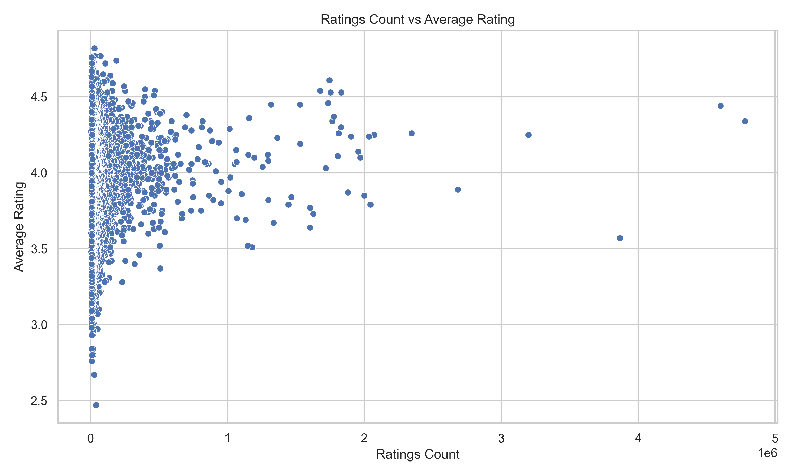

# Data Analysis Project README

## About the Data
This dataset consists of information related to books, including their publication details, ratings, and reviews. It includes 4,648 entries with the following key attributes:
- **books_count**: Total number of books in the dataset.
- **original_publication_year**: Year of the original publication.
- **original_title**: The title of the book.
- **title**: The book title in the dataset.
- **language_code**: Language in which the book is written.
- **average_rating**: Average rating of the book.
- **ratings_count**: Total number of ratings received.
- **work_ratings_count**: Total ratings of the work.
- **work_text_reviews_count**: Total text reviews received.
- **ratings_1 to ratings_5**: Count of ratings distributed across different rating levels (1-5).

The dataset is reflective of the book's reception over the years, capturing a wide range of languages and publication years.

## Analysis Performed
The following key analysis techniques were utilized:
- **Correlation Analysis**: A correlation heatmap was created to examine relationships among various numerical variables.
  
- **Scatter Plots**: Plots were generated to explore relationships between average ratings and ratings counts, and between work ratings counts and work text reviews counts.

The analysis was conducted using Python libraries, such as Pandas for data manipulation and Matplotlib/Seaborn for visualization.

## Insights Discovered
The analysis revealed several key trends:
- A positive correlation exists between work ratings count and work text reviews count, indicating that more reviewed works tend to receive a higher number of ratings.
- The average rating appears to be somewhat logarithmic in nature relative to ratings count, suggesting diminishing returns on average ratings with increasing count.

- The correlation heatmap highlighted that the number of books tends to inversely correlate with original publication year and positively with ratings counts.

## Implications & Recommendations
The findings suggest the following actions:
- Authors and publishers should focus on increasing engagement in terms of text reviews, as it correlates positively with ratings.
- Strategies to boost initial ratings (especially for new works) could lead to better visibility and average ratings down the line.
- Consideration of the correlation between original publication year and ratings may guide marketing strategies for older vs. newer releases.

These insights can inform marketing strategies and operational decisions for enhancing book visibility and reputation.