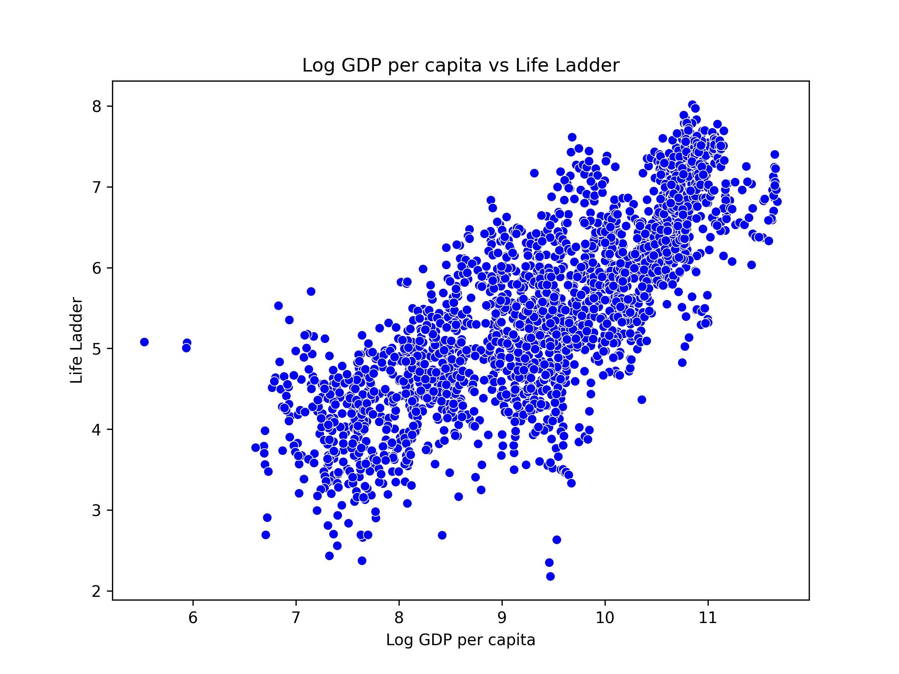

# Data Analysis Project README

## About the Data
This dataset encompasses various factors associated with subjective well-being across different populations. The key attributes are as follows:
- **Life Ladder**: A measure of subjective well-being.
- **Log GDP per capita**: The logarithm of the gross domestic product per capita, representing economic stability.
- **Social support**: A measure of perceived social support.
- **Healthy life expectancy at birth**: Life expectancy adjusted for quality of health.
- **Freedom to make life choices**: Reflects the degree of freedom individuals have in making life decisions.
- **Positive affect**: A measurement of positive emotions.
- **Negative affect**: A measurement of negative emotions.

The dataset consists of 2,109 entries with all columns recorded as float64 type.

## Analysis Performed
The analysis involved the following techniques and methods:
- **Descriptive Statistics**: Summary statistics were computed for all variables to understand data distributions.
- **Correlation Analysis**: A correlation matrix was generated to assess relationships between variables.
- **Scatter Plots**: Various scatter plots were created to visualize the relationships between Life Ladder and other key factors.

## Insights Discovered
The analysis revealed several important trends:
- A strong positive correlation exists between **Log GDP per capita** and **Life Ladder** (0.78), indicating wealthier nations report higher subjective well-being.
- There is a notable relationship between **Social Support** and **Life Ladder** (0.72), highlighting the significance of social networks on well-being.
- Negative correlations were found between **Negative Affect** and **Life Ladder** (-0.35), suggesting that increased negative emotions correlate with lower life satisfaction.

## Implications & Recommendations
Based on the insights, the following actions and recommendations are suggested:
- **Policy Focus on Economic Growth**: Strategies to enhance GDP per capita should be prioritized to improve overall well-being.
- **Enhancing Social Programs**: Investing in social support programs can potentially boost life satisfaction.
- **Mental Health Initiatives**: Development and promotion of mental health resources can mitigate negative emotions.

