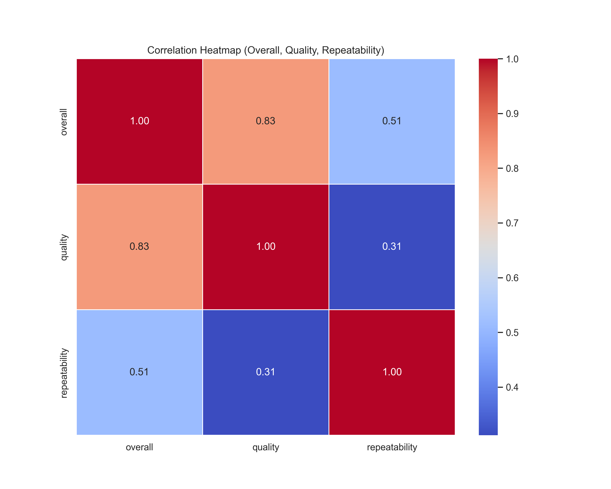
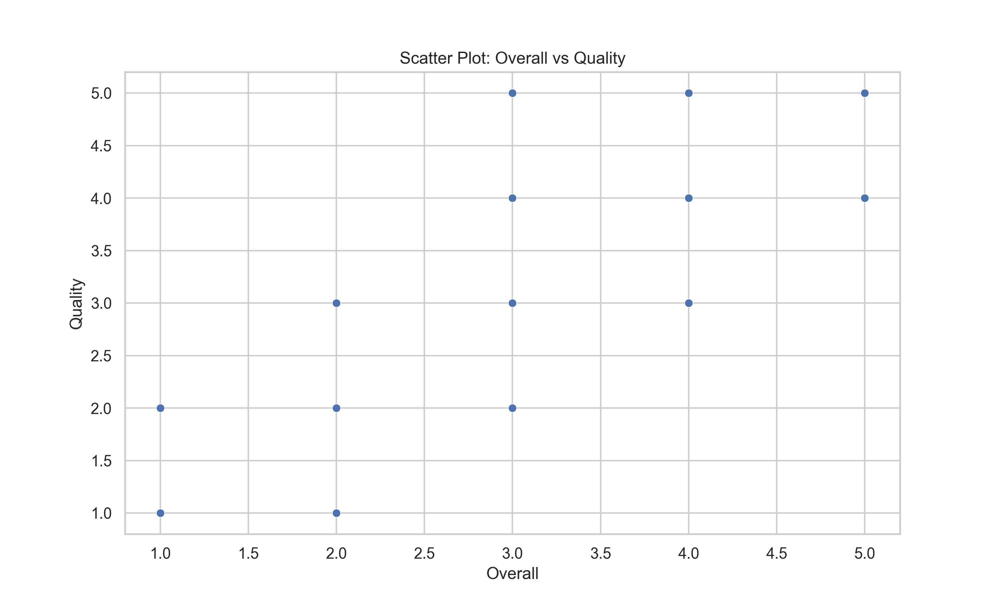
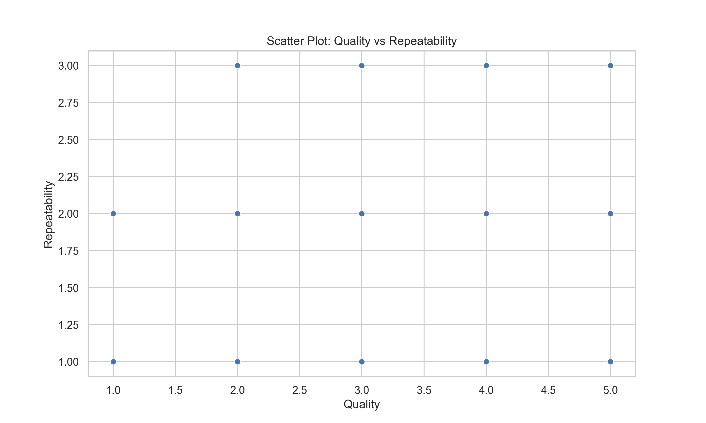

# Data Analysis Project README

## About the Data
The dataset consists of 849 entries with the following key attributes:
- **date**: An integer representing the date.
- **language**: A numerical representation of different languages.
- **type**: A numerical classification of the data.
- **title**: An identifier for the data entries.
- **by**: Refers to the creator of the data.
- **overall**: A rating of overall quality.
- **quality**: A specific measure of quality.
- **repeatability**: An assessment of how repeatable the findings are.

### Summary Statistics
- Total Entries: 849
- Mean Overall: 3.0
- Mean Quality: 3.0
- Mean Repeatability: 1.5

## Analysis Performed
The following analysis techniques were used:
- **Correlation Analysis**: Analyzed relationships between overall, quality, and repeatability to understand interdependencies.
- **Scatter Plots**: Visualized relationships to identify trends, particularly between overall and quality ratings, as well as between quality and repeatability.

## Insights Discovered
Key findings from the analysis include:
- **Strong Correlation**: There is a strong correlation (0.83) between overall and quality ratings, indicating that improvements in quality are likely to enhance overall ratings.
- **Moderate Correlation**: Repeatability shows a moderate correlation to overall ratings (0.51) but a weaker correlation to quality (0.31).
- **Visual Trends**: Scatter plots demonstrated that most data points cluster, showcasing consistency in ratings across overall, quality, and repeatability.

## Implications & Recommendations
Based on the insights, the following recommendations are proposed:
- **Focus on Quality Improvement**: Since quality significantly affects overall ratings, efforts should be directed toward enhancing quality metrics.
- **Review Repeatability Measures**: The weaker correlation of repeatability to both overall and quality indicates a need for further investigation into repeatability practices.

